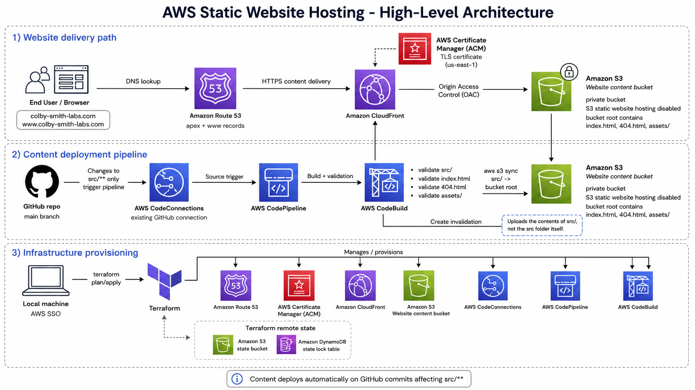

# AWS Static Website Hosting

## 📘 Overview

A Terraform-managed AWS static website hosting project.

This repository provisions and manages a static personal website using Amazon S3, Amazon CloudFront, Route 53, ACM, and CodePipeline/CodeBuild.

The website content is static HTML, CSS, JavaScript, images, and PDFs stored in the `src/` directory. The S3 bucket is private and is served through CloudFront using Origin Access Control. CloudFront serves the site from the private S3 REST endpoint.



## 🎯 Purpose of This Repository

The purpose of this repository is to host a personal static website on AWS using secure, production-style infrastructure.

The project is designed to:

- host a static website using private S3 and CloudFront
- manage DNS through Route 53
- use ACM for HTTPS certificates
- deploy infrastructure with Terraform
- use AWS SSO locally instead of long-lived access keys
- automatically deploy website content when files under `src/` change
- keep website content separate from infrastructure code
- showcase my skills and future projects using a website visible on the internet

## ✨ Features

- Private S3 bucket used as the website origin.
- CloudFront distribution with Origin Access Control.
- HTTPS support using ACM certificate in `us-east-1`.
- Route 53 hosted zone and DNS records for root and `www` domains.
- Terraform-managed infrastructure.
- Remote Terraform state stored in S3 with DynamoDB state locking.
- GitHub-based CodePipeline integration using AWS CodeConnections.
- CodePipeline V2 path filtering for `src/**` changes.
- CodeBuild validation before deployment.
- Automatic sync of the contents of `src/` to the S3 bucket root.
- CloudFront invalidation after successful content deployment.
- No long-lived AWS access keys required for local deployment.


## 📦 Usage

Website content lives in the `src/` directory.

The important structure is:

```text
src/
  index.html
  404.html
  assets/
```

The deployment pipeline watches for changes under:

```text
src/**
```

When changes are pushed to the configured GitHub branch, the pipeline runs CodeBuild and deploys the contents of `src/` to the S3 bucket root.

This means:

```text
src/index.html      -> s3://bucket/index.html
src/404.html        -> s3://bucket/404.html
src/assets/...      -> s3://bucket/assets/...
```

It does not upload the `src` folder itself.

The CodeBuild deployment command is:

```bash
aws s3 sync "${WEBSITE_SOURCE_PATH}/" "s3://${WEBSITE_BUCKET_NAME}/" --delete
```

The trailing slash on `${WEBSITE_SOURCE_PATH}/` is important because it syncs the contents of the directory rather than the directory itself.

After syncing, CodeBuild creates a CloudFront invalidation:

```bash
aws cloudfront create-invalidation --distribution-id "${CLOUDFRONT_DISTRIBUTION_ID}" --paths "/*"
```

## 🏗️ Infrastructure

The infrastructure is managed with Terraform.

The main AWS services used are:

- Amazon S3
- Amazon CloudFront
- CloudFront Origin Access Control
- Amazon Route 53
- AWS Certificate Manager
- AWS CodePipeline
- AWS CodeBuild
- AWS CodeConnections
- AWS IAM
- Amazon CloudWatch Logs

### Website hosting architecture

```text
User
  -> Route 53
  -> CloudFront
  -> Private S3 bucket
```

The S3 bucket is private. Public access is not used for website delivery.

CloudFront is allowed to read objects from the bucket using Origin Access Control and an S3 bucket policy.

### DNS and HTTPS

The domain is managed in Route 53.

ACM is used to issue the HTTPS certificate. Because CloudFront requires ACM certificates to be in `us-east-1`, the Terraform project includes a separate AWS provider alias for `us-east-1`.

The certificate covers:

```text
colby-smith-labs.com
www.colby-smith-labs.com
```

### Content deployment pipeline

The content deployment pipeline uses the reusable CodePipeline module from:

```text
https://github.com/colby-smith/AWS-CodePipeline-Terraform-Module
```

The website repository passes project-specific values into the module, including:

- GitHub repository
- GitHub branch
- existing CodeConnections ARN
- buildspec path
- source path filter
- S3 deployment permissions
- CloudFront invalidation permissions
- CodeBuild environment variables

The pipeline trigger is configured to only run when files under `src/**` change.

### Terraform state

Terraform remote state is stored in S3 with DynamoDB locking.

The backend is configured in `main.tf`.

## 🧪 Testing

The deployment pipeline currently performs basic validation before deploying the website content.

The buildspec checks that:

- the website source directory exists
- `index.html` exists
- `404.html` exists
- the `assets/` directory exists

Current validation commands:

```bash
test -d "${WEBSITE_SOURCE_PATH}"
test -f "${WEBSITE_SOURCE_PATH}/index.html"
test -f "${WEBSITE_SOURCE_PATH}/404.html"
test -d "${WEBSITE_SOURCE_PATH}/assets"
```

If these checks pass, the pipeline syncs the contents of `src/` to S3 and invalidates CloudFront.

Possible future tests include:

- HTML validation
- CSS linting
- JavaScript linting
- broken asset reference checks
- broken link checks
- accessibility checks
- post-deployment HTTP smoke tests

## 📄 License

[MIT License](./LICENSE)
